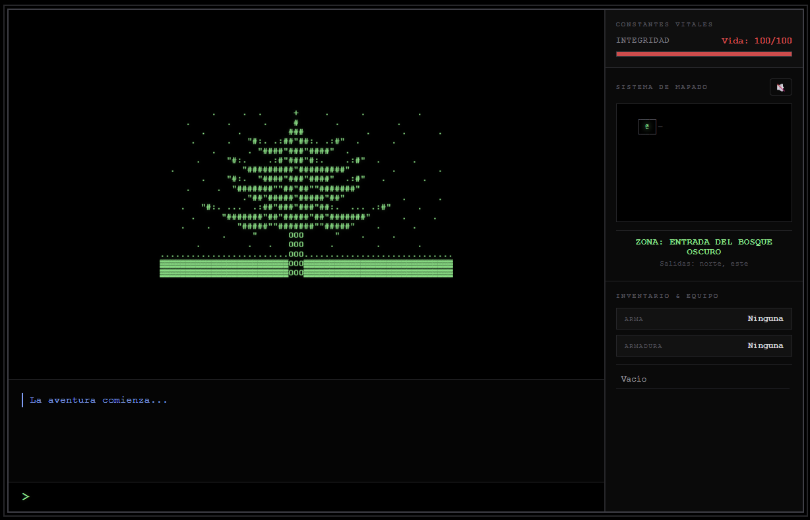

# ⚔️ Crónicas del Amuleto

### *Un juego narrativo de exploración y combate en texto con arte ASCII*

---

---

## 🌑 Historia

El mundo ha caído en la oscuridad. El **Dragón de Sombras** corrompe todo a su paso y solo una leyenda habla de esperanza: el **Amuleto de Luz**, oculto en las profundidades de un mundo en ruinas.

Tú eres el último viajero. Explora bosques corrompidos, ruinas antiguas y volcanes en llamas. Encuentra el amuleto. Derrota al dragón. **Restaura el mundo.**

---

## 🎮 Cómo jugar

El juego se controla completamente escribiendo comandos en la terminal:

| Comando | Acción |
|---|---|
| `ir norte / sur / este / oeste` | Moverse por el mapa |
| `explorar` | Buscar objetos en la zona |
| `mirar` | Examinar el entorno |
| `coger [objeto]` | Recoger un objeto |
| `equipar [objeto]` | Equipar arma o armadura |
| `usar [objeto]` | Usar un consumible |
| `atacar` | Atacar al enemigo en combate |
| `inventario` | Ver objetos que llevas |
| `guardar` / `cargar` | Guardar o cargar partida |

---

## ⚙️ Características

- 🗺️ **Mundo explorable** con múltiples zonas conectadas — bosques, ruinas, cuevas, volcán y guarida del dragón
- ⚔️ **Combate por turnos** con sistema de ataque y defensa
- 🐉 **Jefe final** — el Dragón de Sombras con daño aleatorio e IA de combate
- 🎒 **Sistema de inventario** — armas, armaduras, pociones y artefactos
- 🗿 **Arte ASCII** elaborado para cada localización
- 🔊 **Audio ambiental procedural** generado con Web Audio API
- 💾 **Sistema de guardado** mediante localStorage
- 🗺️ **Minimapa** que se revela conforme exploras
- 📖 **Narrativa de introducción** con lore del mundo

---

## 🚀 Tecnología

Construido íntegramente con tecnologías web nativas, **sin frameworks ni dependencias externas**:

- **HTML5** — estructura y semántica
- **CSS3** — interfaz estilo terminal retro / artefacto arcano
- **JavaScript Vanilla** — lógica completa del juego
- **Web Audio API** — música ambiental procedural

---

## 📸 Capturas

> *Interfaz de terminal retro con arte ASCII, HUD lateral y consola de comandos*  

---

**[▶ JUGAR EN EL NAVEGADOR](https://cristianbr05.github.io/cronicas-del-amuleto/)**

*¿Serás capaz de restaurar la luz en un mundo corrompido?*

---

## 📖 Manual del juego

¿Necesitas ayuda? Descarga el manual completo con todas las mecánicas, comandos y secretos del juego.

---

## 👤 Autor

**Cristian Bellmunt Redón**

*Desarrollador web & sistemas · ASIX · España*

---

*"En un mundo corrompido por la oscuridad, solo la luz del conocimiento puede guiar el camino."*

